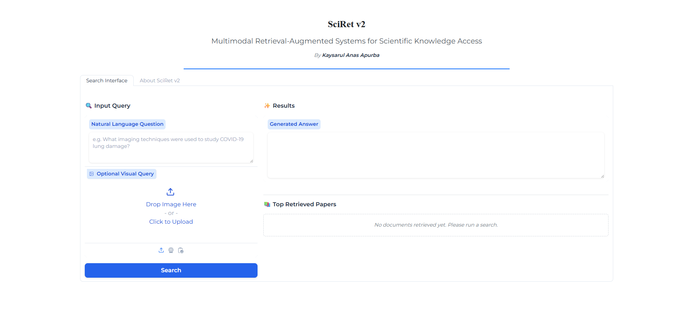

<div align="center">


# SciRet v2
### Multimodal Retrieval-Augmented Systems for Scientific Knowledge Access

*An evolution of the original SciRet (2022) — extending text-only RAG to reason across text, figures, tables, and equations in scientific literature.*



</div>

---

## Overview

Scientific papers are multimodal documents. A paper on COVID-19 lung imaging conveys critical information through CT scan figures, comparison tables of patient outcomes, and statistical charts — not just through text. A retrieval system that ignores these modalities is, by definition, incomplete.

**SciRet v2** addresses this gap by building a modern Retrieval-Augmented Generation (RAG) pipeline that indexes and retrieves across all content types in scientific papers, then uses a vision-language model to generate grounded, cited answers.

This project is both a research contribution and a PhD preparation portfolio, targeting publication at ECIR / ACL workshops.

---

## Research Questions

| # | Question |
|---|----------|
| **RQ1** | Does incorporating multimodal content — figures, tables, visual elements — into a RAG pipeline improve the quality, completeness, and faithfulness of answers to scientific queries compared to text-only retrieval? |
| **RQ2** | How does a modern text-only RAG system (2026 components) compare to the original SciRet (2022) on the same retrieval and generation tasks? |
| **RQ3** | What is the most effective strategy for fusing text and visual modalities — late fusion, early fusion, or learned fusion? |
| **RQ4** | How can hallucination be detected and reduced in scientific answer generation where factual accuracy is critical? |

---

## Architecture

```
┌─────────────────────────────────────────────────────────────────┐
│                        INPUT LAYER                              │
│          Natural language query  /  Optional image query        │
└──────────────────────────┬──────────────────────────────────────┘
                           │
┌──────────────────────────▼──────────────────────────────────────┐
│                   DOCUMENT PROCESSING                           │
│  Text chunks │ Figure extraction │ Table serialisation          │
│  (PyMuPDF)   │ (PyMuPDF + BLIP-2) │ (pdfplumber)               │
└──────────────────────────┬──────────────────────────────────────┘
                           │
┌──────────────────────────▼──────────────────────────────────────┐
│                  MULTIMODAL EMBEDDING                           │
│  Text → BGE-M3 (1024d)   │   Figures → CLIP ViT-B/32 (512d)    │
│  Tables → BGE-M3          │   Captions → BGE-M3                 │
└──────────────────────────┬──────────────────────────────────────┘
                           │
┌──────────────────────────▼──────────────────────────────────────┐
│                     HYBRID INDEX                                │
│       Sparse (BM25)  ←──── Reciprocal Rank Fusion ────►  Dense  │
│                              (ChromaDB)                         │
└──────────────────────────┬──────────────────────────────────────┘
                           │
┌──────────────────────────▼──────────────────────────────────────┐
│               RETRIEVAL & RERANKING                             │
│   Stage 1: Hybrid search → top-100 candidates                   │
│   Stage 2: Cross-encoder reranker → top-5 passages              │
└──────────────────────────┬──────────────────────────────────────┘
                           │
┌──────────────────────────▼──────────────────────────────────────┐
│                  ANSWER GENERATION                              │
│   Text answers: Mistral 7B (with citation grounding)            │
│   Visual answers: LLaVA-7B (for figure-based queries)           │
└──────────────────────────┬──────────────────────────────────────┘
                           │
┌──────────────────────────▼──────────────────────────────────────┐
│                     EVALUATION                                  │
│   Retrieval: Recall@K, MRR, NDCG                                │
│   Generation: RAGAS (Faithfulness, Relevance, Groundedness)     │
└─────────────────────────────────────────────────────────────────┘
```

---

## Technology Stack

| Component | 2022 (SciRet v1) | 2026 (SciRet v2) |
|-----------|-----------------|-----------------|
| Framework | Haystack v1 *(deprecated)* | LangChain v0.3+ |
| Text Embedder | DPR bi-encoder | BGE-M3 |
| Sparse Retrieval | None | BM25 (rank-bm25) |
| Vector Store | FAISS flat index | ChromaDB |
| Reranker | None | ms-marco-MiniLM cross-encoder |
| Generator | GPT-Neo 2.7B | Mistral 7B / Gemini API |
| Multimodal | None | CLIP + BLIP-2 + LLaVA |
| Evaluation | None (qualitative) | RAGAS framework |
| UI | Flask | Gradio |

---

## Dataset

This project uses the **CORD-19 (COVID-19 Open Research Dataset Challenge)** — over 400,000 scholarly articles about COVID-19 and related coronaviruses.

- Source: [Kaggle — Allen Institute for AI](https://www.kaggle.com/datasets/allen-institute-for-ai/CORD-19-research-challenge)
- Size: ~64GB (full), subset used for experiments
- Content: Title, abstract, full text, figures, tables, metadata

> The dataset is not included in this repository due to size. See `Dataset_Link.txt` or the Kaggle link above.

---

## Project Structure

```
sciret-v2/
│
├── notebooks/
│   ├── 01_data_exploration.ipynb       # CORD-19 dataset analysis
│   ├── 02_text_chunking.ipynb          # Chunking strategy experiments
│   ├── 03_embedding_baseline.ipynb     # BGE-M3 embedding pipeline
│   ├── 04_hybrid_retrieval.ipynb       # BM25 + dense hybrid search
│   ├── 05_reranking.ipynb              # Cross-encoder reranking
│   ├── 06_figure_extraction.ipynb      # PDF figure extraction
│   ├── 07_clip_embeddings.ipynb        # CLIP multimodal embeddings
│   ├── 08_multimodal_pipeline.ipynb    # Full multimodal RAG
│   └── 09_evaluation.ipynb            # RAGAS evaluation & comparison
│
├── src/
│   ├── data/
│   │   ├── loader.py                   # CORD-19 data loading
│   │   ├── chunker.py                  # Text chunking strategies
│   │   └── pdf_parser.py              # Figure & table extraction
│   ├── embeddings/
│   │   ├── text_embedder.py           # BGE-M3 text embedding
│   │   └── vision_embedder.py         # CLIP image embedding
│   ├── retrieval/
│   │   ├── bm25_retriever.py          # Sparse BM25 retrieval
│   │   ├── dense_retriever.py         # Dense vector retrieval
│   │   ├── hybrid_retriever.py        # RRF fusion
│   │   └── reranker.py                # Cross-encoder reranking
│   ├── generation/
│   │   ├── text_generator.py          # Mistral 7B generation
│   │   └── visual_generator.py        # LLaVA visual QA
│   ├── evaluation/
│   │   └── ragas_eval.py             # RAGAS evaluation pipeline
│   └── pipeline.py                    # Full end-to-end pipeline
│
├── app/
│   └── gradio_app.py                  # Gradio demo interface
│
├── legacy/                            # Original SciRet 2022 code
│   ├── Data-Preparation.ipynb
│   ├── Train.ipynb
│   └── Testing_Save_and_Load_Model.ipynb
│
├── results/
│   └── comparison_table.md            # System comparison results
│
├── requirements.txt
├── Dataset_Link.txt
└── README.md
```

---

## Comparison: SciRet v1 vs v2

*Results table will be populated as experiments are completed.*

| System | Recall@5 | MRR | Faithfulness | Answer Relevance |
|--------|----------|-----|--------------|-----------------|
| SciRet 2022 (DPR + GPT-Neo) | — | — | — | — |
| SciRet v2 Text-only | — | — | — | — |
| SciRet v2 Multimodal | — | — | — | — |

---

## Roadmap

- [x] Original SciRet system (BSc Senior Design, 2022)
- [ ] **Phase 0** — Foundations & theory (in progress)
- [ ] **Phase 1** — Environment setup & CORD-19 data pipeline
- [ ] **Phase 2** — Modern text RAG baseline
- [ ] **Phase 3** — Multimodal extension (CLIP + BLIP-2 + LLaVA)
- [ ] **Phase 4** — Evaluation & comparison experiments
- [ ] **Phase 5** — Paper writing & arXiv submission
- [ ] Gradio demo deployment (Hugging Face Spaces)

---

## Getting Started

### Prerequisites

- Python 3.10+
- Google Colab (recommended) or a machine with at least 8GB RAM
- CORD-19 dataset downloaded from Kaggle

### Installation

```bash
git clone https://github.com/YOUR_USERNAME/sciret-v2.git
cd sciret-v2
pip install -r requirements.txt
```

### Quick Start

```python
from src.pipeline import SciRetPipeline

pipeline = SciRetPipeline()
pipeline.load_index("./index/")

result = pipeline.query(
    "What imaging techniques were used to study COVID-19 lung damage?"
)

print(result.answer)
print(result.sources)
```

> Full setup instructions and notebook walkthroughs coming in Phase 1.

---

## Background

This project is a direct evolution of **SciRet** (2022), a BSc Senior Design Project at the Department of Electrical and Computer Engineering, North South University, Bangladesh. The original system used GPT-Neo and DPR to build a passage retrieval system over the CORD-19 dataset.

SciRet v2 modernises the architecture, extends it to multimodal inputs, and introduces rigorous quantitative evaluation — addressing the core limitations of the 2022 system.

**Original project report:** See `/legacy/` directory  
**Original GitHub:** [Anaskaysar/SciRet-Scientific-Information-Made-Easy](https://github.com/Anaskaysar/SciRet-Scientific-Information-Made-Easy)

---

## Publication Target

This work targets submission to:
- **ECIR 2026** — European Conference on Information Retrieval
- **ACL workshops** — NLP for scientific documents
- **arXiv preprint** — posted upon draft completion

---

## Author

**Kaysarul Anas Apurba**  
MSc Graduate | Independent Researcher |
Laurentian University,
Sudbury, Ontario, Canada.


*This project is part of a PhD application portfolio.*

---

## License

MIT License — see `LICENSE` for details.

---

## Acknowledgements

- Original SciRet (2022) supervised by Dr. Mohammad Ashrafuzzaman Khan, North South University.
- CORD-19 dataset provided by Allen Institute for AI
- Built on the shoulders of the RAG (Lewis et al., 2020), DPR (Karpukhin et al., 2020), CLIP (Radford et al., 2021), and RAGAS (Es et al., 2023) papers

---

<div align="center">
<sub>SciRet v2 — Research in progress — Started March 2026</sub>
</div>
