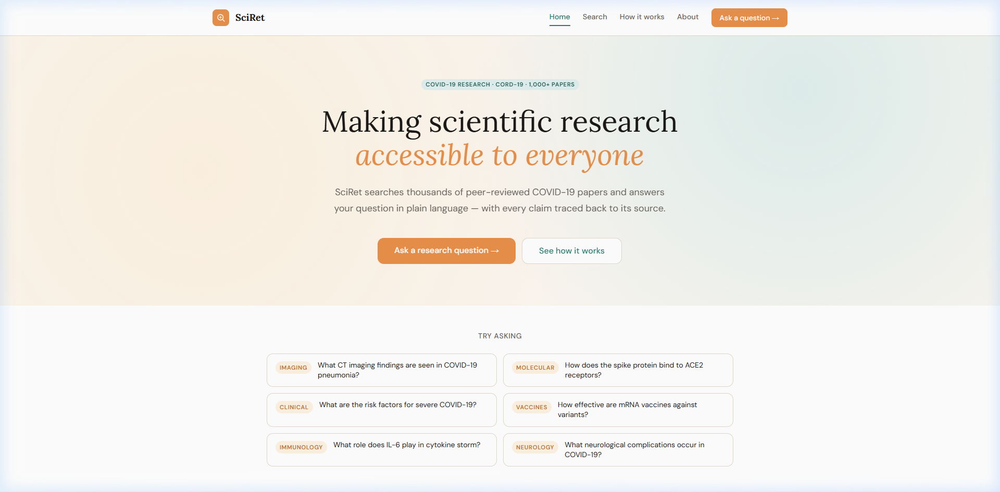
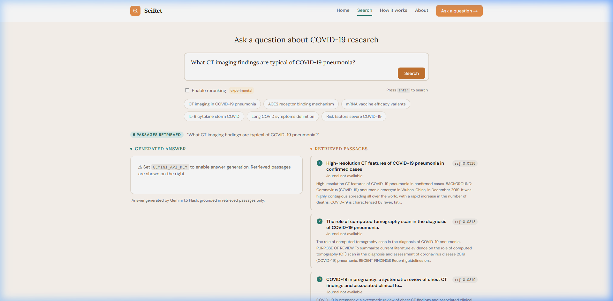
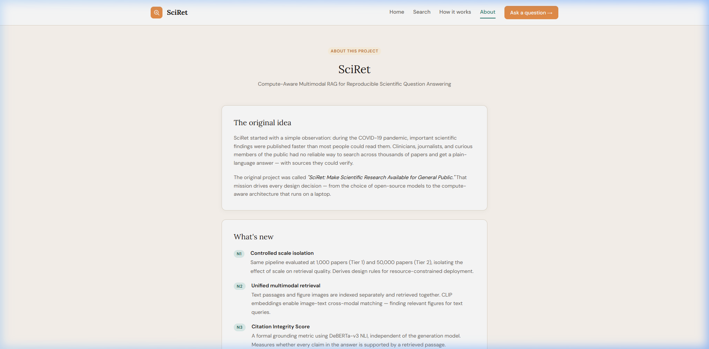
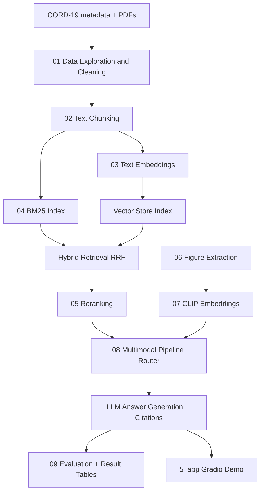

<div align="center">


<!--  -->


# SciRet

### A Compute-Aware Multimodal RAG Framework for Reproducible Scientific Question Answering

_An evolution of the original SciRet (2022) — extending text-only RAG to reason across text, figures, tables, and equations in scientific literature._

### Scientific Journal Interface (2026 Evolution)

|                **Home**                |           **Search & Synthesis**           |
| :------------------------------------: | :----------------------------------------: |
|  |  |

|             **About & Team**             |
| :--------------------------------------: |
|  |

</div>

---

## Overview

<p class="text-justify">Scientific papers are multimodal documents. A paper on COVID-19 lung imaging conveys critical information through CT scan figures, comparison tables of patient outcomes, and statistical charts — not just through text. A retrieval system that ignores these modalities is, by definition, incomplete.

**SciRet** addresses this gap by building a modern Retrieval-Augmented Generation (RAG) pipeline that indexes and retrieves across all content types in scientific papers, then uses a vision-language model to generate grounded, cited answers.

This project is both a research contribution and a PhD preparation portfolio, targeting publication at ECIR / ACL workshops.

</p>

## Research Questions

| #       | Question                                                                                                                                                                                                             |
| ------- | -------------------------------------------------------------------------------------------------------------------------------------------------------------------------------------------------------------------- |
| **RQ1** | Does incorporating multimodal content — figures, tables, visual elements — into a RAG pipeline improve the quality, completeness, and faithfulness of answers to scientific queries compared to text-only retrieval? |
| **RQ2** | How does a modern text-only RAG system (2026 components) compare to the Legacy SciRet (2022) on the same retrieval and generation tasks?                                                                             |
| **RQ3** | What is the most effective strategy for fusing text and visual modalities — late fusion, early fusion, or learned fusion?                                                                                            |
| **RQ4** | How can hallucination be detected and reduced in scientific answer generation where factual accuracy is critical?                                                                                                    |

---

## Architecture

```
┌─────────────────────────────────────────────────────────────────┐
│                        INPUT LAYER                              │
│          Natural language query  /  Optional image query        │
└──────────────────────────┬──────────────────────────────────────┘
                           │
┌──────────────────────────▼──────────────────────────────────────┐
│                   DOCUMENT PROCESSING                           │
│  Text chunks │ Figure extraction │ Table serialisation          │
│  (PyMuPDF)   │ (PyMuPDF + BLIP-2) │ (pdfplumber)               │
└──────────────────────────┬──────────────────────────────────────┘
                           │
┌──────────────────────────▼──────────────────────────────────────┐
│                  MULTIMODAL EMBEDDING                           │
│  Text → BGE-M3 (1024d)   │   Figures → CLIP ViT-B/32 (512d)    │
│  Tables → BGE-M3          │   Captions → BGE-M3                 │
└──────────────────────────┬──────────────────────────────────────┘
                           │
┌──────────────────────────▼──────────────────────────────────────┐
│                     HYBRID INDEX                                │
│       Sparse (BM25)  ←──── Reciprocal Rank Fusion ────►  Dense  │
│                              (ChromaDB)                         │
└──────────────────────────┬──────────────────────────────────────┘
                           │
┌──────────────────────────▼──────────────────────────────────────┐
│               RETRIEVAL & RERANKING                             │
│   Stage 1: Hybrid search → top-100 candidates                   │
│   Stage 2: Cross-encoder reranker → top-5 passages              │
└──────────────────────────┬──────────────────────────────────────┘
                           │
┌──────────────────────────▼──────────────────────────────────────┐
│                  ANSWER GENERATION                              │
│   Text answers: Mistral 7B (with citation grounding)            │
│   Visual answers: LLaVA-7B (for figure-based queries)           │
└──────────────────────────┬──────────────────────────────────────┘
                           │
┌──────────────────────────▼──────────────────────────────────────┐
│                     EVALUATION                                  │
│   Retrieval: Recall@K, MRR, NDCG                                │
│   Generation: RAGAS (Faithfulness, Relevance, Groundedness)     │
└─────────────────────────────────────────────────────────────────┘
```

### Modular Pipeline Flow



### High-Fidelity Architecture


---

## Technology Stack

| Component        | 2022 (Legacy SciRet)       | 2026 (SciRet)                 |
| ---------------- | -------------------------- | ----------------------------- |
| Framework        | Haystack v1 _(deprecated)_ | LangChain v0.3+               |
| Text Embedder    | DPR bi-encoder             | BGE-M3                        |
| Sparse Retrieval | None                       | BM25 (rank-bm25)              |
| Vector Store     | FAISS flat index           | ChromaDB                      |
| Reranker         | None                       | ms-marco-MiniLM cross-encoder |
| Generator        | GPT-Neo 2.7B               | Mistral 7B / Gemini API       |
| Multimodal       | None                       | CLIP + BLIP-2 + LLaVA         |
| Evaluation       | None (qualitative)         | RAGAS framework               |
| UI               | Flask                      | Gradio                        |

---

## Performance & Memory Management

SciRet uses state-of-the-art multimodal models that require significant memory (VRAM or Unified Memory).

- **OOM Errors**: If you encounter `RuntimeError: MPS backend out of memory` (on Mac) or `CUDA out of memory`, reduce the `batch_size` in the embedding or generation steps.
- **Recommended Batch Sizes**:
  - **Tier 1 (1k papers)**: Default `batch=16`.
  - **Tier 2 (50k papers)**: Scale according to your hardware (e.g., A100/H100 on Kaggle).
- **Kernel Hygiene**: Restart the Jupyter kernel between massive processing runs to clear cached memory allocations.
- **Cache-or-Build**: Precomputed embeddings and indexes are persisted in `1_data/` to avoid redundant computation. If you change models or chunking parameters, ensure you clear these caches.

> [!NOTE]
> For more technical details on system design, see [system_design_readme.md](0_docs/system_design_readme.md).

---

## Dataset

This project uses the **CORD-19 (COVID-19 Open Research Dataset Challenge)** — over 400,000 scholarly articles about COVID-19 and related coronaviruses.

- Source: [Kaggle — Allen Institute for AI](https://www.kaggle.com/datasets/allen-institute-for-ai/CORD-19-research-challenge)
- Size: ~64GB (full), subset used for experiments
- Content: Title, abstract, full text, figures, tables, metadata

> [!TIP]
> The dataset is not included in this repository due to size. See `Dataset_Link.txt` or the Kaggle link above.

## Data Workflow

1.  **Raw Data**: Place CORD-19 `metadata.csv` in `1_data/raw/`.
2.  **Data Exploration & Cleaning**: Run `3_notebooks/01_data_exploration.ipynb`. This exports a cleaned sampled subset (Tier 1 default: 1,000 papers).
3.  **Chunking**: Run `3_notebooks/02_text_chunking.ipynb` to produce chunked text artifacts.
4.  **Embeddings + Retrieval Pipeline**: Run notebooks `03` to `09` in order for embedding, retrieval, reranking, multimodal integration, and evaluation.

### Tiered Evaluation Protocol

- **Tier 1 (Development, local):** 1,000 papers for fast debugging and iteration.
- **Tier 2 (Experiments, Kaggle):** 50,000 papers for primary paper results.
- **Tier 3 (Optional):** full CORD-19 only if additional compute is available.

The same preprocessing, chunking, retrieval, and generation settings should be held constant across tiers; only corpus scale changes.

---

## Project Structure

```
sciret/
│
├── 0_docs/                            # Documentation, design docs, and images
│   └── Images/                        # Screenshots and diagrams
│
├── 1_data/                            # Local data (Ignored by Git)
│
├── 2_src/                             # Source code
│   ├── data/
│   │   ├── loader.py                  # CORD-19 data loading
│   │   ├── chunker.py                 # Text chunking strategies
│   │   └── pdf_parser.py              # Figure & table extraction
│   ├── embeddings/
│   │   ├── text_embedder.py           # BGE-M3 text embedding
│   │   └── vision_embedder.py         # CLIP image embedding
│   ├── retrieval/
│   │   ├── bm25_retriever.py          # Sparse BM25 retrieval
│   │   ├── dense_retriever.py         # Dense vector retrieval
│   │   ├── hybrid_retriever.py        # RRF fusion
│   │   └── reranker.py                # Cross-encoder reranking
│   ├── generation/
│   │   ├── text_generator.py          # Mistral 7B generation
│   │   └── visual_generator.py        # LLaVA visual QA
│   ├── evaluation/
│   │   └── ragas_eval.py              # RAGAS evaluation pipeline
│   └── pipeline.py                    # Full end-to-end pipeline
│
├── 3_notebooks/                       # Development & experimentation
│   ├── 01_data_exploration.ipynb      # CORD-19 dataset analysis
│   ├── 02_text_chunking.ipynb         # Chunking strategy experiments
│   ├── 03_embedding_baseline.ipynb    # BGE-M3 embedding pipeline
│   ├── 04_hybrid_retrieval.ipynb      # BM25 + dense hybrid search
│   ├── 05_reranking.ipynb             # Cross-encoder reranking
│   ├── 06_figure_extraction.ipynb     # PDF figure extraction
│   ├── 07_clip_embeddings.ipynb       # CLIP multimodal embeddings
│   ├── 08_multimodal_pipeline.ipynb   # Full multimodal RAG
│   └── 09_evaluation.ipynb           # RAGAS evaluation & comparison
│
├── 4_results/                         # Experiment outputs & evaluation results
│   └── comparison_table.md           # System comparison results
│
├── 5_app/                             # Demo application
│   └── gradio_app.py                 # Gradio demo interface
│
├── 6_legacy/                          # Legacy SciRet 2022 code & reports
│   ├── Data-Preparation.ipynb
│   ├── Train.ipynb
│   └── Testing_Save_and_Load_Model.ipynb
│
├── requirements.txt
├── Dataset_Link.txt
└── README.md
```

---

## Comparison: Legacy SciRet vs SciRet 2026

_Results table will be populated as experiments are completed._

| System                      | Recall@5 | MRR | Faithfulness | Answer Relevance |
| --------------------------- | -------- | --- | ------------ | ---------------- |
| SciRet 2022 (DPR + GPT-Neo) | —        | —   | —            | —                |
| SciRet Text-only            | —        | —   | —            | —                |
| SciRet Multimodal           | —        | —   | —            | —                |

---

## Roadmap

- [x] Legacy SciRet system (BSc Senior Design, 2022)
- [ ] **Phase 0** — Foundations & theory (in progress)
- [ ] **Phase 1** — Environment setup & CORD-19 data pipeline
- [ ] **Phase 2** — Modern text RAG baseline
- [ ] **Phase 3** — Multimodal extension (CLIP + BLIP-2 + LLaVA)
- [ ] **Phase 4** — Evaluation & comparison experiments
- [ ] **Phase 5** — Paper writing & arXiv submission
- [ ] Gradio demo deployment (Hugging Face Spaces)

---

## Getting Started

### Prerequisites

- Python 3.10+
- Google Colab (recommended) or a machine with at least 8GB RAM
- CORD-19 dataset downloaded from Kaggle

### Installation

```bash
git clone https://github.com/Anaskaysar/SciRet
cd SciRet
pip install -r requirements.txt
```

### Paper Template and Submission Note

The scientific content (method, experiments, results) remains the same across submissions, but the paper must be formatted to each venue's template (e.g., ECIR, ACL workshop, journal style). Keep one canonical draft in `Paper/main.tex`, then adapt formatting and section ordering per venue before submission.

### Quick Start

```python
from pipeline import SciRetPipeline  # when running from project source path

pipeline = SciRetPipeline()
pipeline.load_index("./index/")

result = pipeline.query(
    "What imaging techniques were used to study COVID-19 lung damage?"
)

print(result.answer)
print(result.sources)
```

> Full setup instructions and notebook walkthroughs coming in Phase 1.

---

## Background

This project is a direct evolution of **SciRet** (2022), a BSc Senior Design Project at the Department of Electrical and Computer Engineering, North South University, Bangladesh. The original system used GPT-Neo and DPR to build a passage retrieval system over the CORD-19 dataset.

SciRet modernises the architecture, extends it to multimodal inputs, and introduces rigorous quantitative evaluation — addressing the core limitations of the 2022 system.

**Original project report:** See `/legacy/` directory  
**Original GitHub:** [Anaskaysar/SciRet-Scientific-Information-Made-Easy](https://github.com/Anaskaysar/SciRet-Scientific-Information-Made-Easy)

---

## Publication Target

This work targets submission to:

- **ECIR 2026** — European Conference on Information Retrieval
- **ACL workshops** — NLP for scientific documents
- **arXiv preprint** — posted upon draft completion

> [!NOTE]
> The manuscript is maintained in Overleaf for editor/coauthor collaboration. This repository focuses on code, experiments, and reproducible artifacts used by the paper.

---

## Author

**Kaysarul Anas Apurba**  
MSc Graduate | Independent Researcher |
Laurentian University,
Sudbury, Ontario, Canada.

_This project is part of a PhD application portfolio._

---

## License

MIT License — see `LICENSE` for details.

---

## Acknowledgements

- Original SciRet (2022) supervised by Dr. Mohammad Ashrafuzzaman Khan, North South University.
- CORD-19 dataset provided by Allen Institute for AI
- Built on the shoulders of the RAG (Lewis et al., 2020), DPR (Karpukhin et al., 2020), CLIP (Radford et al., 2021), and RAGAS (Es et al., 2023) papers

---

<div align="center">
<sub>SciRet — Research in progress — Started March 2026</sub>
</div>
